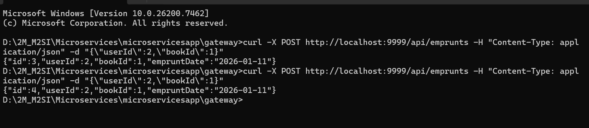

# Projet MSA - Application de Gestion d'Emprunts

**Nom:** CHICHANE 
**Prénom:** Widad 
**Date:**  2026

---

## 📋 Description

Application de gestion d'emprunts basée sur une architecture microservices avec Spring Boot, MySQL et Kafka.

---

## 🏗️ Architecture

**Microservices principaux :**

- **Eureka Server** (8761) : découverte des services  
- **Gateway** (8080) : point d'entrée et routage  
- **User Service** (8082) : gestion des utilisateurs  
- **Book Service** (8081) : gestion des livres  
- **Emprunter Service** (8085) : gestion des emprunts, publication Kafka  
- **Notification Service** (8087) : notifications via Kafka

**Base de données :**  
Chaque service possède sa propre base MySQL (`db_user`, `db_book`, `db_emprunter`).

---

## 📨 Kafka

- **Topic :** `emprunt-created`  
- **Producteur :** Emprunter Service  
- **Consommateur :** Notification Service  

**Exemple de message :**
```json
{
  "empruntId": 1,
  "userId": 3,
  "bookId": 5,
  "eventType": "EMPRUNT_CREATED",
  "timestamp": "2025-01-01T14:00:00"
}


# Installation rapide
# Cloner
git clone https://github.com/[votre-username]/microservicesapp.git
cd microservicesapp

# Compiler
.\mvnw clean install -DskipTests

# Démarrer Docker
docker-compose up -d

Accès aux services :

Eureka : http://localhost:8761

# Créer un utilisateur
curl -X POST http://localhost:9999/api/users \
  -H "Content-Type: application/json" \
  -d '{"name":"John doe","email":"john.doe@example.com"}'

# Créer un livre
curl -X POST http://localhost:9999/api/books \
  -H "Content-Type: application/json" \
  -d '{"titre":"Spring Boot"}'

# Créer un emprunt
curl -X POST http://localhost:9999/api/emprunts \
  -H "Content-Type: application/json" \
  -d '{"userId":1,"bookId":1}'


vous trouvrez-vous ci-dessus une image avec le test
